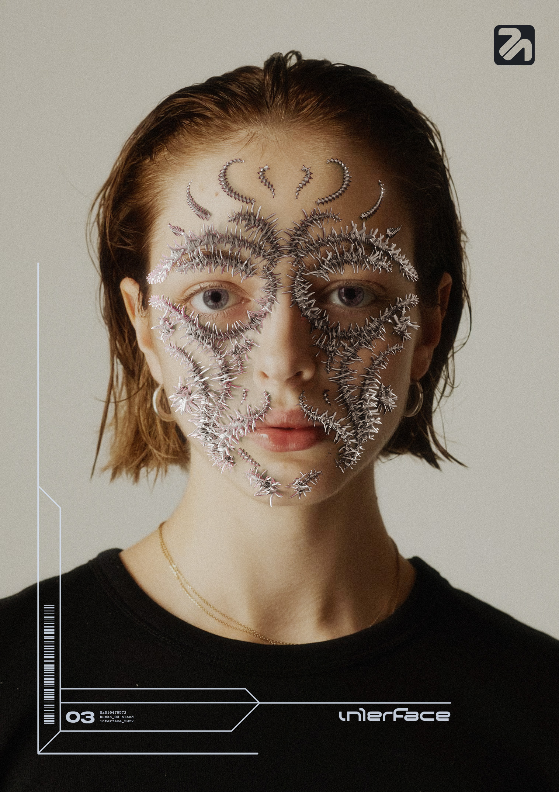
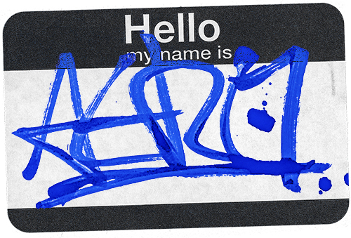

# 02 - First impression 

# First Impression

## About me:

My name is Max. I'm a graphic designer and digital artist based in Prague, Czechia.

Currently working at Incognito Studio and Aurora Studio, but ready to work on new and exciting projects!

## Featured Projects

### Diverse 3D stuff

- This project serves as a further, second exploration into mixing images of human models with 3D elements.
- As creating shadows in raster editing software can be time consuming to get right and does not look very convincing, i used Blender and its Geometry Nodes component to create a tribal mask shape to see how rendered shadows hold up.

- This project serves as a proof-of-concept for making netcore, y2k inspired abstract art.
- Not many people show you how to create art similar to theirs, so i set out to replicate a artist i enjoy following. 
- **[Inspiration - sort of](https://twitter.com/aletiune/status/1542909684016881664?s=61&t=9f2ZKNh4lISCLE6214UhbA)**

## More art:

- [--> Look through more of my stuff here <--](aerostri.de)

## Notes

Numbered comments about each featured project as presenter notes or speaking points.

1. Just freestyle it :)

