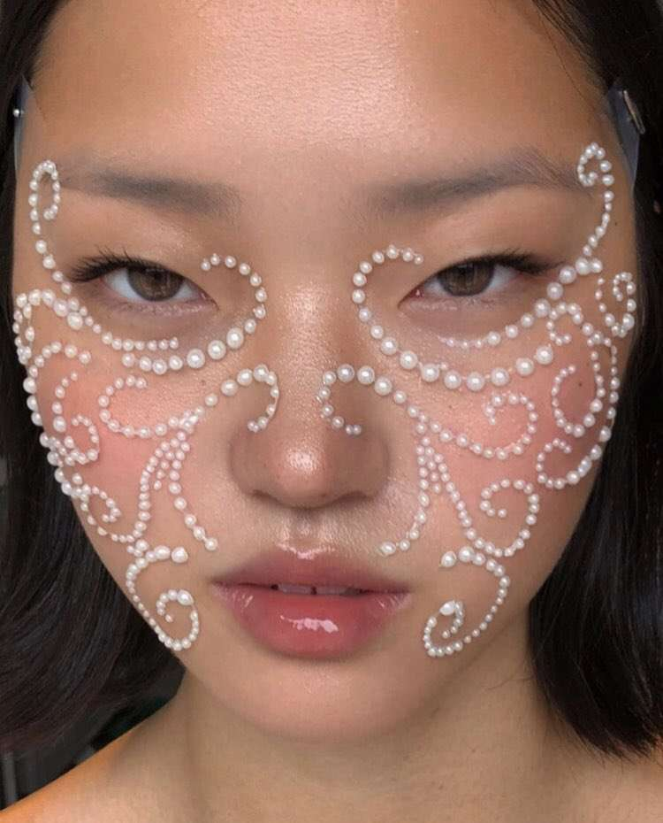
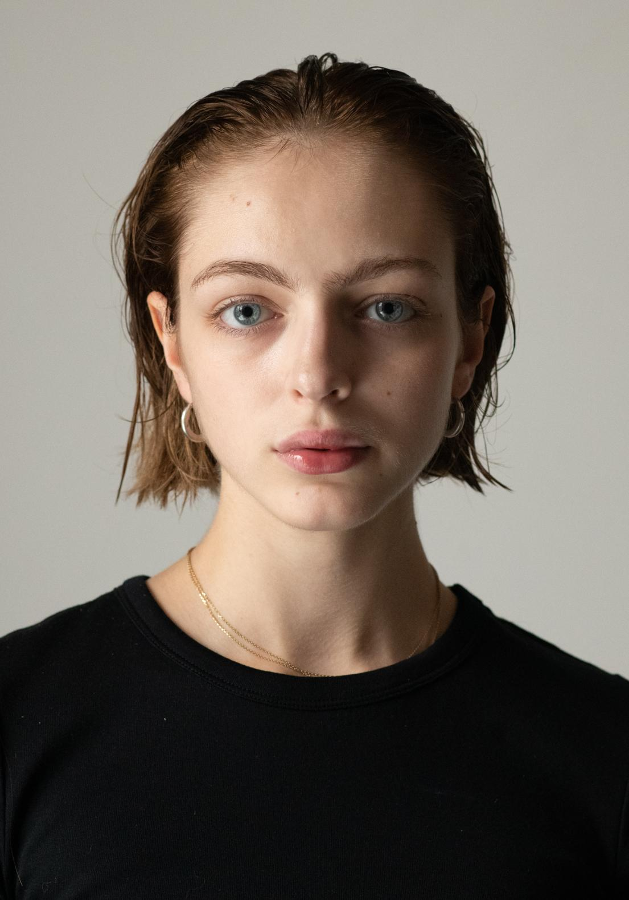
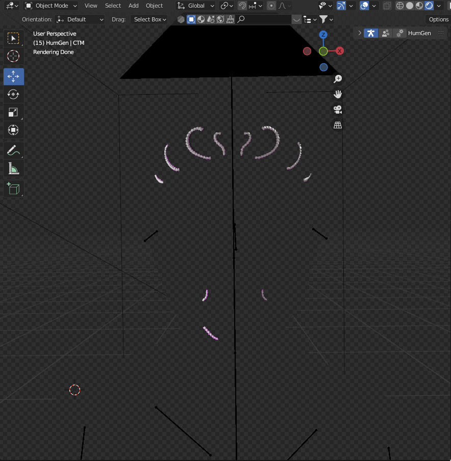
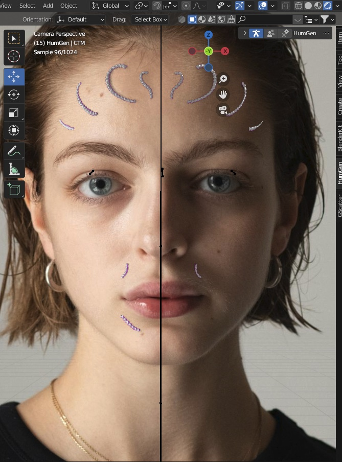
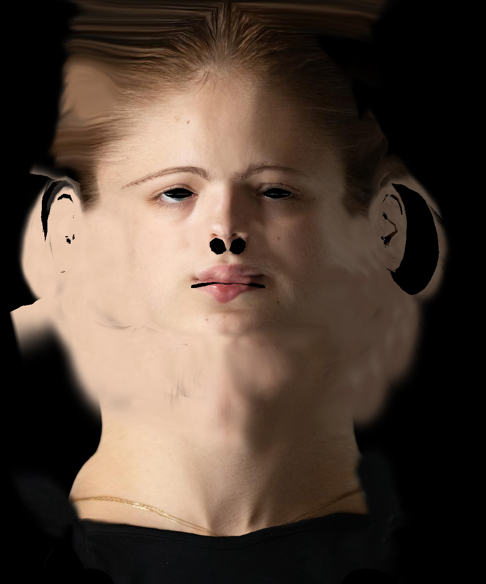
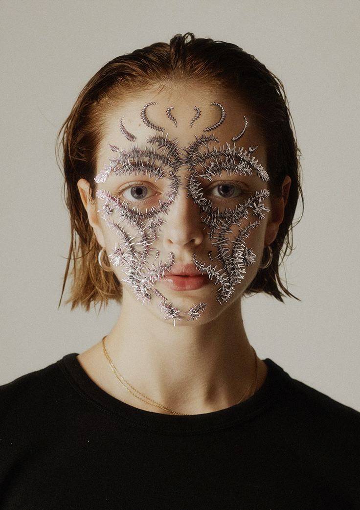

## Case study: Human-03

This is a case study on some of the "intricacies" and the process behind this image:

---

### Intro

#### Inspiration

The inspiration for this image are fashion magazine editorials and makeup advertisements, similar to pictures like these:

#### Base image

Let's see what we're working with...

*Folio Montreal Models - Fahey*
[Source](https://foliomontreal.com/en/models/fahey)

#### Breakdown

Here is a quick lazy breakdown of the "layers" this scene has...

From front to back:

<ol start="0">
  <li>Camera</li>
  <li>Mask</li>
  <li>A textured 3D human model</li>
</ol>

The camera plays a vital part in setting up the scene to achieve this exact look, here is why...

---

### The process

The secret lies here: The textured 3D model is hidden and is assigned a attribute called "Shadow catcher". This means that the object is hidden to the camera, but it can interact with other objects in the scene, so light still bounces off of it and can influence the color and intensity of shadows.

Afterwards, the original 2D image is put "onto" the camera, lining everything up perfectly. In this image without any edits, you can see the 3D elements being cast onto the 2D image with nice, soft shadows that would be very hard and/or time consuming to achieve with Photoshop.

To nail the correct look, shadows and colors of the metallic object a texture is created for the hidden 3D object. You can imagine this as just the 2D image "painted" on top of the 3D "human".

The last part was done in Photoshop, where i fixed some of the details and tuned the colors of the image to my final liking...

...and finished it all off with some typography.

---

### Recap

- Length: About a day for the scene and render itself. The know-how took about a week and a test project to fully understand and get comfortable with.
- Software used: Blender, Cycles render, Adobe Photoshop
- Fun: A lot
- Learned: A lot

---

[Back](index.md)
