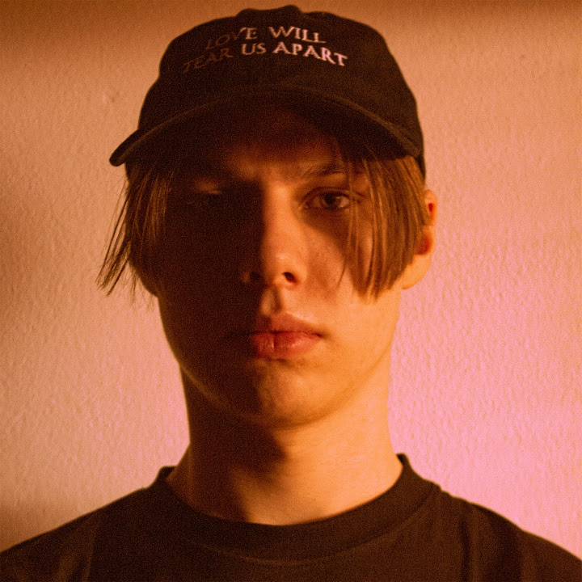

## About Me

Hi, I'm Max! A graphic designer and artist born in Prague, Czechia who loves to work on fresh and exciting projects!

## My Story

I started out sometime in 2015, on a questionable copy of Photoshop CC 2015 and have been evolving and refining my craft ever since.

For most of my "career" I was working mostly on 2D visuals with the ocassional typesetting or MS Office job but lately 3D graphics have been a part of design I got into and wish to delve even deeper.

I also very much enjoy working with textures along and taking a approach similar to mixed media.

Things i enjoy:

- Architecture photography
- Fashion (design)
- Memes

Things i do:

- Creative Cloud 
- MS Suite/Google Suite/LibreOffice/whatever office suite you please
- Blender

## Featured Project

- This project was a second, more intricate experiment for mixing 3D models with 2D imagery.
- It consists of the metallic object being placed on a 3D human figure which takes on the texture of the 2D image.

- [Click here for more info](case-study.md)
